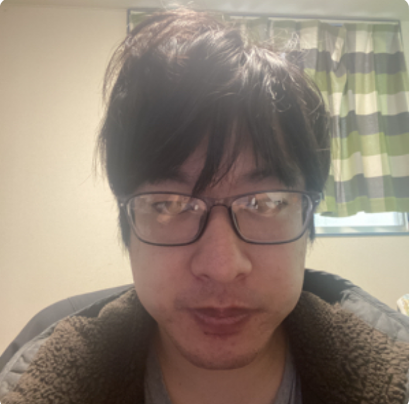
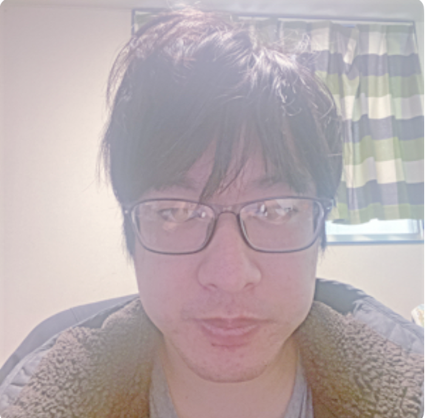
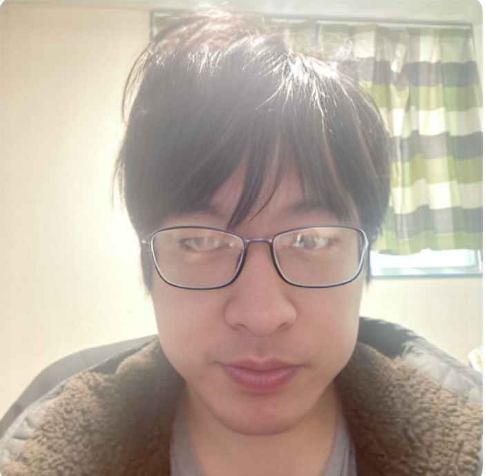
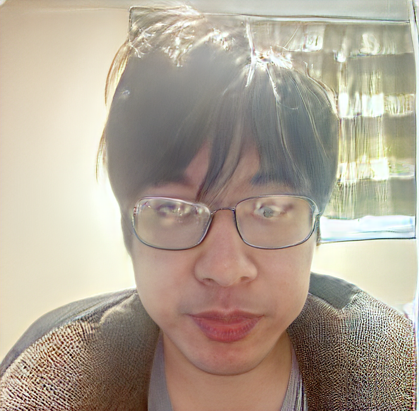
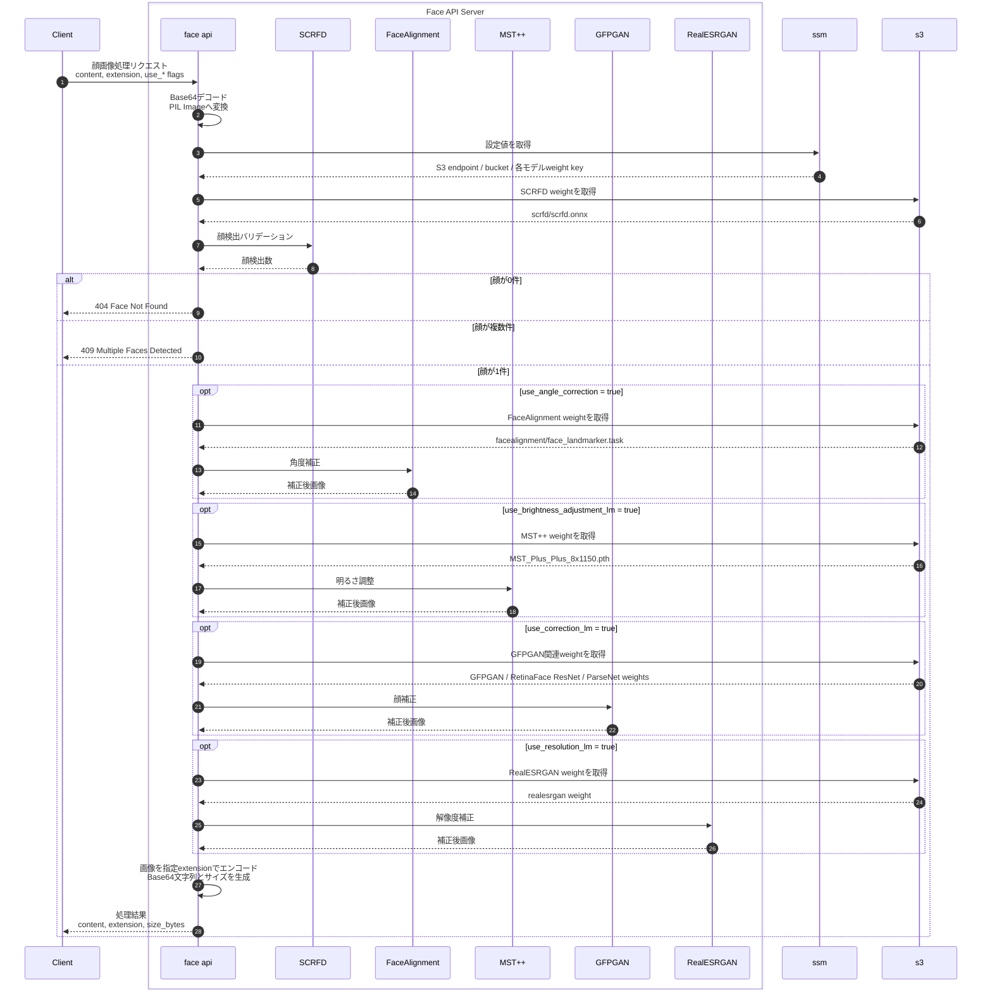
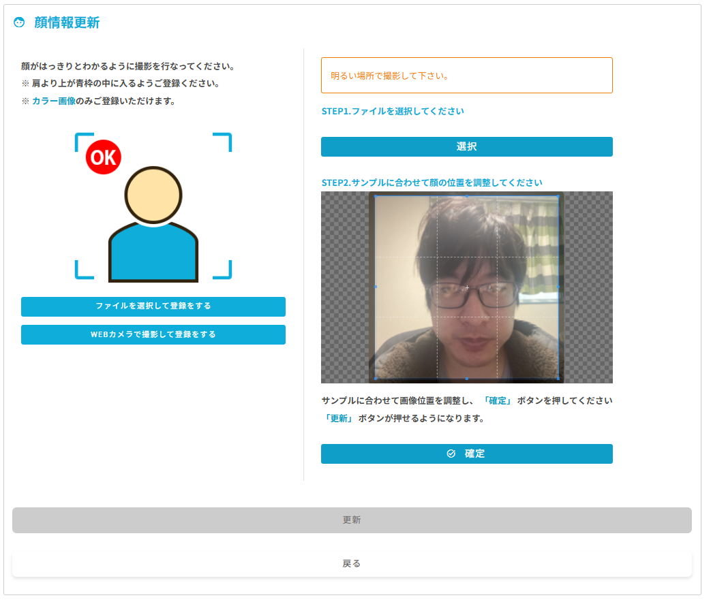
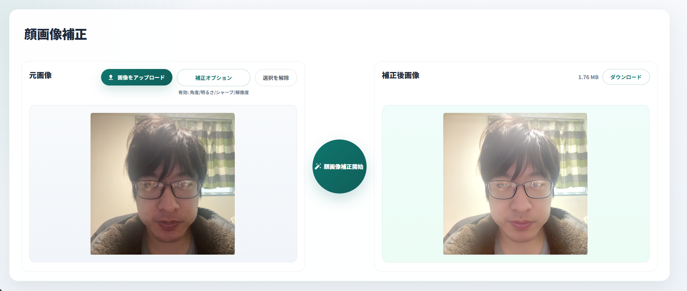
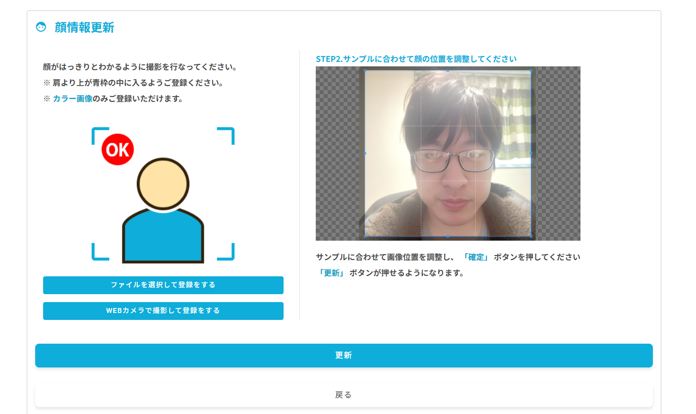

# freeiDのユーザービリティ向上をAIで実現する

## 概要

freeiD は顔認証により各種サービスを利用しやすくする顔認証プラットフォームである。利用開始にあたり、ユーザーは必ず顔画像を登録する必要がある。

### 課題: 顔画像登録時のエラーによる離脱

顔登録が完了すれば生活は便利になる一方、**顔画像登録時の判定エラーで何度もリトライが必要になるケース**がある。営業からも、アプリネイティブ世代ではないユーザーにとって、再撮影はかなりのストレスになっているとの報告を受けている。

現在はマンション管理者や賃貸仲介者がサポートしてくれるケースもあるため、登録離脱は限定的である。しかし今後、ユーザーが自主的に freeiD へ登録するケースが増えると予想される。

### 離脱リスクの試算

Contentsquare 社が紹介する大手保険会社の事例では、見積もりフォームについて以下の結果が報告されている。[1]

| 指標 | 数値 |
|------|------|
| フォームエラー発生率 | 47% |
| エラー後の断念率 | 13% |
| **全体に対する離脱率** | **約 6.1%** |

この離脱率を freeiD に当てはめた場合の試算:

| 期間 | 登録者数 (月 100 人想定) | 離脱推計人数 |
|------|------------------------|------------|
| 1 か月 | 100 人 | **約 6 人** |
| 1 年 | 1,200 人 | **約 72 人** |
| 10 年 | 12,000 人 | **約 720 人** |

この潜在顧客の離脱を防ぐことを課題と定義し、解決策を検討した。

---

## 方法

顔認証に関する論文を調査したところ、認証精度向上に有効な前処理として以下の 3 点が挙げられていた。

| 前処理 | 目的 |
|--------|------|
| 照明補正 | 暗所・逆光による顔の見えにくさを改善 |
| コントラスト・テクスチャ強化 | 顔の細部をより鮮明に |
| 顔の正面化 | 顔の傾きや向きを正規化 |

顔登録前の画像チェック時にこれらの処理を施すことで、判定エラーの低減と認証精度の向上が期待できる。これを踏まえ、上記の前処理を組み込んだアプリを作成した。

## 処理戦略
処理対象の顔画像  
   ↓  
顔存在バリデーション  
   ↓  
画像に明るさ補正をかける  
   ↓  
顔補正を実施。  
   ↓  
顔の正面化  
   ↓  
処理完了  

## 技術調査
### 選定基準
今回は以下の2つの基準を設け、その範囲で使用可能なモデルをピックアップ、動作検証を行った。  
※ アーキテクチャや論文調査はAIを用いてまとめた内容である。  

1. ローカル環境で推論ができるオープンモデルである。
   商用利用を想定した場合、外部APIなどで顔画像を外部に渡してしまう場合個人情報の流出などのセキュリティリスクが出てくる。
   そのため、ローカル環境で推論と出力ができるオープンモデルであることを条件とした。

2. 商用利用可能なオープンモデルである。
   オープンソースでもライセンスによっては商用利用ができないなどの制限があるものが存在する。そのため、商用利用可能なライセンスが
   明記されているものであることを条件とした。

### 明るさ調整AIモデル
#### 概要

本資料では、低照度画像の明るさ調整に使用できる 2 つの AI モデルについて調査・比較を行う。

| 項目 | MST++ (Multi-stage Spectral-wise Transformer) | Zero-DCE (Zero-Reference Deep Curve Estimation) |
|------|-------------------------------------------|-------------------------------------------------|
| 発表年 | 2022 (NTIRE Challenge) | 2020 (CVPR) |
| アーキテクチャ | Transformer (Attention ベース) | CNN (軽量) |
| 学習方式 | 教師あり学習 (ペア画像) | 教師なし学習 (参照画像不要) |
| 用途 | 高品質な画像強調 | 低照度画像強調 |
| 重みファイル | MST_Plus_Plus_8x1150.pth | Epoch99.pth |

---

#### 1. MST++ (Multi-stage Spectral-wise Transformer)

##### 1.1 概要

**MST++** は、スペクトル復元向けに提案された Transformer ベースのモデルである。今回は、MST++ のアーキテクチャを RGB 3 チャネル入出力の画像強調向けに構成し、NTIRE Night Photography データで学習した重み `MST_Plus_Plus_8x1150.pth` を使用した。スペクトル方向の Multi-head Self-Attention を核として、U-Net 型のエンコーダ・デコーダ構造を採用している。

- **論文**: *MST++: Multi-stage Spectral-wise Transformer for Efficient Spectral Reconstruction* (CVPR Workshops 2022) [2]
- **MST++ GitHub**: 公式リポジトリ [3]

##### 1.2 アーキテクチャ

U-Net 型のエンコーダ・デコーダ構造に MST ブロックを 3 段直列に並べた構成。各 MST ブロックは MSAB (Multi-head Spectral Attention Block) を持つエンコーダ・ボトルネック・デコーダで構成され、スキップ接続で結ばれる。入出力に残差接続を持ち、任意解像度の画像に対応する。

###### コアモジュール: MS-MSA (Multi-head Spectral Self-Attention)

$$\text{Attn} = \text{softmax}(K^T Q \cdot \alpha) \cdot V$$

- Q, K, V はすべてチャネル次元 (スペクトル方向) に対して計算
- スケールパラメータ $\alpha$ は学習可能
- 空間位置の埋め込みに Depth-wise Conv を使用 (`pos_emb`)

###### FeedForward ネットワーク

1×1 Conv → GELU → 3×3 DWConv (深さ方向畳み込み) → GELU → 1×1 Conv の 5 層構成。

##### 1.3 学習設定

| 項目 | 値 |
|------|-----|
| データセット | NTIRE Night Photography (ペア画像) |
| パッチサイズ | 1150 × 1150 |
| バッチサイズ (合計) | 8 GPUs × 1 = 8 |
| 総学習イテレーション | 150,000 |
| オプティマイザ | Adam (lr=2e-4, β=(0.9, 0.999)) |
| スケジューラ | Cosine Annealing Restart Cyclic |
| 損失関数 | L1 Loss |
| データ拡張 | MixUp (β=1.2), 幾何学的拡張 |

##### 1.4 入出力サンプル

| 加工前 | 加工後 (MST++) |
|--------|----------------|
|  |  |

- 全体的な明るさが向上し、暗部のディテールが改善される
- 色温度のバランスが自然に補正される
- 過露出になりにくく、ハイライトが保持される

---

#### 2. Zero-DCE (Zero-Reference Deep Curve Estimation)

##### 2.1 概要

**Zero-DCE** は、参照画像 (正解ペア) を一切使わずに低照度画像を強調できる、初の教師なし深層学習手法である。画像ごとに最適な「明るさ調整カーブ」を推定し、反復的に適用することで自然な強調を実現する。

- **論文**: *Zero-Reference Deep Curve Estimation for Low-Light Image Enhancement* (CVPR 2020) [4]
- **著者**: Chunle Guo et al. (Nankai University)
- **GitHub**: 公式リポジトリ [5]

##### 2.2 アーキテクチャ

7 層の軽量 CNN にスキップ接続を加えた U 字型構造。エンコーダ 4 層で特徴を拡張し、デコーダ 3 層でスキップ連結しながら縮小する。最終層の Tanh 出力は 24ch (= 3ch × 8 カーブパラメータ) であり、各チャネルに対して LE カーブを 8 回反復適用して明るさを調整する。

###### カーブ適用式

各ピクセルに対して以下を 8 回繰り返す:

$$x_{n} = x_{n-1} + r_n \cdot (x_{n-1}^2 - x_{n-1})$$

- $r_n \in [-1, 1]$ (Tanh 出力) は LE (Light Enhancement) カーブの強度
- $r_n > 0$ : 画像を明るく調整
- $r_n < 0$ : 画像を暗く調整
- この式は単調増加関数であり、色相が変わらない

##### 2.3 モデル構成

| 項目 | 値 |
|------|-----|
| 総パラメータ数 | 約 79K (非常に軽量) |
| 特徴マップ数 | 32ch |
| Convolution 層数 | 7 |
| 出力チャネル | 24ch (= 3ch × 8 カーブ) |
| プーリング | なし |
| バッチ正規化 | なし |
| 活性化関数 | ReLU (中間層), Tanh (最終層) |

##### 2.4 学習設定 (参考)

教師なし学習のため、以下の損失関数を組み合わせる:

| 損失 | 役割 |
|------|------|
| Spatial Consistency Loss | 隣接ピクセル間の一貫性保持 |
| Exposure Control Loss | 露出の目標値への収束 |
| Color Constancy Loss | 各チャネルのバランス維持 |
| Illumination Smoothness Loss | カーブパラメータの滑らかさ |

##### 2.5 入出力サンプル

| 加工前 | 加工後 (Zero-DCE) |
|--------|-------------------|
|  |  |

- 画像全体が明るく調整される
- ハイライト部分がやや過露出になる傾向がある
- 処理速度が速く、リアルタイム処理に向いている

---

#### 3. 比較・考察

##### 3.1 性能比較

| 比較項目 | MST++ | Zero-DCE |
|----------|-------|----------|
| 画質 | ★★★★★ 高品質 | ★★★☆☆ 良好 |
| 推論速度 | ★★★☆☆ やや低速 | ★★★★★ 高速 |
| モデルサイズ | ★★★☆☆ 中程度 | ★★★★★ 軽量 |
| 汎化性能 | ★★★★☆ 高い | ★★★★☆ 高い |
| 学習データ | 要ペア画像 | 不要 |
| 過露出耐性 | ★★★★★ 強い | ★★★☆☆ 普通 |

##### 3.2 今回のサンプル画像での結果

入力画像は室内でやや暗めに撮影された顔写真。

- **MST++**: 自然な明るさ補正。暗部が持ち上がりつつ、ハイライトが飛ばない。色温度も保持される。
- **Zero-DCE**: 全体的に明るくなるが、頬周辺など明るい箇所が過露出気味になる。髪の毛など暗部のディテールはやや失われる。

##### 3.3 用途別の使い分け

| ユースケース | 推奨モデル | 理由 |
|------------|-----------|------|
| 高品質な画像補正 (オフライン処理) | MST++ | Transformer の高表現力 |
| リアルタイム処理 / 組み込み | Zero-DCE | 軽量・高速 |
| 教師データがない場合 | Zero-DCE | 教師なし学習 |
| 夜景・暗所写真の補正 | MST++ | NTIRE 夜景データで学習 |
| モバイルデプロイ | Zero-DCE | パラメータ数 ~79K |

### 顔補正
#### 概要

本資料では、顔画像の高品質化・補正に使用できる 2 つの AI モデルについて調査・比較を行う。

| 項目 | GFPGAN (GFPGANv1Clean) | VQFR (VQFRv1) |
|------|------------------------|----------------|
| 発表年 | 2021 (CVPR) | 2022 (ECCV) |
| アーキテクチャ | StyleGAN2 + U-Net + SFT | VQGAN + Transformer + DCN |
| 学習方式 | 教師あり学習 (GAN ベース) | 教師あり学習 (VQ ベース) |
| 用途 | 顔画像復元・高品質化 | 顔画像復元・テクスチャ補正 |
| 重みファイル | GFPGANv.pth | VQFR_v1-33a1fac5.pth |

---

#### 1. GFPGAN (Generative Facial Prior GAN)

##### 1.1 概要

**GFPGAN** は、StyleGAN2 に学習済みの顔の事前知識 (Generative Facial Prior) を組み込んだ、盲目的顔画像復元モデルである。U-Net 型エンコーダが劣化顔画像から特徴を抽出し、SFT (Spatial Feature Transform) を介して StyleGAN2 デコーダを条件付けすることで、リアルな顔テクスチャを生成する。[11]

- **論文**: *Towards Real-World Blind Face Restoration with Generative Facial Priors* (CVPR 2021) [6]
- **著者**: Xintao Wang et al. (ARC Lab, Tencent PCG)
- **GitHub**: 公式リポジトリ [7]

##### 1.2 アーキテクチャ (GFPGANv1Clean)

U-Net 型エンコーダ・デコーダ構造に StyleGAN2 デコーダを組み合わせた構成。エンコーダが劣化画像から特徴を抽出し、スタイルコードと SFT 条件を生成して StyleGAN2 生成器を制御する。

###### コアモジュール: Modulated Convolution

StyleGAN2 の中核となる Weight Modulation & Demodulation:

$$\text{demod} = \frac{1}{\sqrt{\sum_{i,j}(w_{ijk} \cdot s_i)^2 + \epsilon}}$$

$$y = w_{\text{demod}} * x$$

- $s_i$: スタイルコードから Linear 変換されたモジュレーション係数
- Demodulation により各出力チャネルの分散が正規化される

###### SFT (Spatial Feature Transform)

$$\text{out} = \text{feat} \cdot \text{scale} + \text{shift}$$

- `scale`, `shift` は U-Net デコーダの各解像度特徴マップから生成
- `sft_half=True` の場合、チャネルの後半半分のみに SFT を適用

##### 1.3 依存コンポーネント

| コンポーネント | 役割 | モデルファイル |
|-------------|------|-------------|
| RetinaFace (ResNet50) | 顔検出 | detection_Resnet50_Final.pth |
| ParseNet | 顔領域パーシング | parsing_parsenet.pth |
| FaceRestoreHelper (facexlib) | アライメント・顔の切り出し・貼り戻し | - |

##### 1.4 入出力サンプル

| 加工前 | 加工後 (GFPGAN) |
|--------|----------------|
|  |  |

- 眼鏡フレームや目周辺のエッジがシャープになり、輪郭がより明確になった
- 肌のざらつきが抑えられ、滑らかなテクスチャに整えられた
- 背景・衣類はほぼ原画を保持しており、違和感のない自然な仕上がり
- 全体的な変化は控えめだが、顔領域の品質向上が確認できる

---

#### 2. VQFR (Vector-Quantized Dictionary Feedback for Face Restoration)

##### 2.1 概要

**VQFR** は、VQGAN の離散コードブックを活用して顔テクスチャの高周波成分を復元する顔画像補正モデルである。低品質入力から抽出した特徴でコードブックを索引し、高忠実度なテクスチャを Deformable Convolution によって元の特徴マップに反映させる。[10]

- **論文**: *VQFR: Blind Face Restoration with Vector-Quantized Dictionary and Parallel Decoder* (ECCV 2022) [8]
- **著者**: Yuchao Gu et al. (Nankai University / S-Lab)
- **GitHub**: 公式リポジトリ [9]

##### 2.2 アーキテクチャ (VQFRv1)

VQGANエンコーダで入力特徴を抽出し、離散コードブックで量子化した後、並列デコーダと MainDecoder の 2 系統で復元を行う。MainDecoder は TextureWarpingModule により DCNv2 でテクスチャ整合を行い、入力特徴を残差として最終出力を生成する。

###### コアモジュール: TextureWarpingModule

入力特徴 (`x_main`) に DCNv2 (Deformable Convolution) を用いて、入力テクスチャ特徴 (`prior`) からオフセットを生成し、テクスチャを動的に整合させる。前段のオフセットを引き継いで段階的に精製する連鎖構造を持つ。

###### VQ (Vector Quantization) 量子化

$$z_q = \arg\min_{e_k \in \mathcal{E}} \|z - e_k\|_2$$

- $\mathcal{E}$: コードブック (1024 エントリ × 256 次元)
- L2 距離で最近傍のコードを索引
- KMeans による定期的なコードブック更新

##### 2.3 入出力サンプル

| 加工前 | 加工後 (VQFR) |
|--------|---------------|
|  |  |

- 顔の肌は滑らかに補正され、明度・彩度がやや向上した
- 一方、髪・背景のカーテン・衣類に VQGAN コードブック由来の強いテクスチャアーティファクトが発生し、画像全体として大きく歪んでいる
- VQFR はアライン済みの 512×512 顔クロップ画像を前提とした設計のため、背景を含む全体画像を入力するとこのような崩れが生じる
- 本モデルを使用する際は、事前に顔領域の切り出し・アライメントが必須

---

#### 3. 比較・考察

##### 3.1 性能比較

| 比較項目 | GFPGAN | VQFR |
|----------|--------|------|
| 顔領域の画質 | ★★★★☆ 良好・自然 | ★★★☆☆ 補正されるが人工的 |
| 推論速度 | ★★★☆☆ 中程度 | ★★★☆☆ 中程度 |
| モデルサイズ | ★★★☆☆ 中〜大 | ★★★☆☆ 中〜大 |
| 背景・非顔領域の保持 | ★★★★★ ほぼ保持 | ★☆☆☆☆ 強いアーティファクト |
| フルシーン画像への適用 | ★★★★★ 対応 (顔検出あり) | ★☆☆☆☆ 非対応 (クロップ前提) |
| セットアップ容易性 | ★★★☆☆ やや複雑 | ★★☆☆☆ クロップ前処理が必要 |

##### 3.2 アーキテクチャの違い

| 観点 | GFPGAN | VQFR |
|------|--------|------|
| 生成器の基盤 | StyleGAN2 (連続潜在空間) | VQGAN (離散コードブック) |
| 特徴整合手法 | SFT (アフィン変換) | DCNv2 (変形可能畳み込み) |
| 条件付け方式 | スタイルコード + SFT 条件 | Vector Quantization + Texture Warping |
| 出力数 | 1 (復元画像) | 2 (main_dec + dec) |
| 顔検出の要否 | 必要 (facexlib) | 不要 (直接処理) |

##### 3.3 用途別の使い分け

| ユースケース | 推奨モデル | 理由 |
|------------|-----------|------|
| 背景込みの顔写真の補正 | GFPGAN | 顔検出・アライメント・貼り戻しが自動処理される |
| 圧縮アーティファクトの除去 | GFPGAN | 背景を保持しつつ顔領域のみ自然に復元 |
| アライン済み顔クロップの高品質化 | VQFR | コードブックによる高忠実度テクスチャ補完が有効 |
| パイプラインへの組み込み | GFPGAN | GFPGANer クラスで入力形式を問わず利用可能 |
| 研究目的・クロップ顔データの評価 | VQFR | ECCV 2022 手法で顔クロップデータでは高精度 |

### 顔角度補正
#### 概要

本資料では、顔写真の正面補正に使用できる **MediaPipe Face Landmarker** について調査・整理する。  
Face Landmarker は顔画像を生成的に正面化するモデルではなく、顔ランドマーク検出結果をもとに顔の傾き・向きの妥当性を推定するモデルである。

| 項目 | MediaPipe Face Landmarker |
|------|----------------------------|
| 提供元 | Google / MediaPipe |
| モデルファイル | face_landmarker.task |
| 用途 | 顔検出・顔ランドマーク推定・顔姿勢推定 |
| 入力 | RGB 画像 |
| 出力 | 顔ランドマーク座標 |
| 想定用途 | 目・鼻・口の位置から顔の傾きと正面性を判定 |
| 補正対象 | roll のみ |
| 判定対象 | yaw / pitch / 複数顔 / 顔未検出 |

---

#### 1. MediaPipe Face Landmarker

##### 1.1 概要

**MediaPipe Face Landmarker** は、画像または動画から顔領域と顔ランドマークを検出する MediaPipe Tasks の顔解析モデルである。顔の輪郭、目、鼻、口などの詳細な点群を推定できるため、顔の位置合わせ、表情解析、AR エフェクト、本人確認用画像の前処理などに利用できる。[12]

- **モデル種別**: 顔ランドマーク推定モデル
- **使用ファイル**: `weights/face_landmarker.task`
- **対応入力**: 静止画像・動画
- **主な出力**: 顔ランドマーク、顔領域、顔姿勢推定に利用できる座標情報

##### 1.2 アーキテクチャ上の位置づけ

本モデルは、入力画像から顔を検出し、顔上のランドマーク座標を返す推論モデルである。モデルの出力は、以下のような幾何学的な補正・判定に利用できる。

| 処理 | 使用するランドマーク | 目的 |
|------|----------------------|------|
| roll 算出 | 左目・右目 | 顔の左右方向の傾きを角度で算出 |
| yaw 判定 | 両目中心・鼻先 | 横向きの強さを比率で判定 |
| pitch 判定 | 両目中心・鼻先・口中心 | 上下向きの強さを比率で判定 |
| 顔数判定 | 検出結果 | 顔なし・複数顔をエラー化 |

---

#### 2. 正面補正への利用方法

##### 2.1 使用ランドマーク

| 部位 | インデックス | 用途 |
|------|--------------|------|
| 左目 | 33, 133 | 左目中心の算出 |
| 右目 | 362, 263 | 右目中心の算出 |
| 鼻先 | 1 | yaw / pitch 判定 |
| 口中心 | 13, 14 | pitch 判定 |

左右の目と口は複数点の平均座標を使うことで、単一点の検出誤差に対して少し安定した判定にしている。

##### 2.2 roll 補正

roll は、左右の目を結ぶ線の角度から算出する。[13]

$$
\theta = \mathrm{atan2}(y_{right} - y_{left}, x_{right} - x_{left})
$$

算出した角度に基づいて画像全体を回転すると、左右の目が水平に近づき、顔の傾きが補正される。

##### 2.3 yaw / pitch 判定

yaw と pitch は画像を補正するのではなく、正面画像として許容できるかを判定するために使用している。

| 指標 | 算出方法 | 閾値 |
|------|----------|------|
| roll | 左右の目を結ぶ線の角度 | ±25.0 度 |
| yaw | 鼻先と両目中心の x 方向ズレ / 目間距離 | 0.30 |
| pitch | 鼻先 y 座標と期待鼻位置のズレ / 目口間距離 | 0.20 |

roll は回転で補正可能だが、yaw と pitch は顔の 3D 向きに起因するため、2D 回転だけで自然に補正することは難しい。そのため、大きな横向き・上下向きは補正対象外として扱う方が自然である。

---

#### 3. 入出力サンプル

| 加工前 | 加工後 |
|--------|--------|
|  |  |

- 左右の目の傾きに基づき、画像全体の roll が補正される
- 顔の向きが閾値内であれば、背景を含めた画像全体を自然に回転できる
- 顔の横向きや上下向きが大きい画像は、無理に生成補正せずエラーとして扱う

---

#### 4. 比較・考察

##### 4.1 生成型正面化との違い

| 観点 | MediaPipe Face Landmarker + 幾何補正 | 生成型の顔正面化モデル |
|------|--------------------------------------|--------------------------|
| 処理内容 | ランドマーク検出と 2D 回転 | 顔画像の生成・再構成 |
| 補正可能な姿勢 | 主に roll | roll / yaw / pitch に対応可能な場合がある |
| 顔の同一性 | 元画像をほぼ保持 | 生成により変化するリスクがある |
| 背景保持 | 画像全体をそのまま回転 | 顔領域以外の扱いが難しい |
| 導入容易性 | 高い | 学習済みモデル・前後処理が複雑 |
| 登録画像の前処理 | 向いている | 本人性の変化に注意が必要 |

##### 4.2 今回の方式の利点

- 顔のテクスチャを生成しないため、本人性が変わりにくい
- MediaPipe の `.task` ファイルだけで推論でき、導入負荷が比較的低い
- roll 補正と姿勢チェックを分離しているため、登録用画像の品質管理に使いやすい
- 複数顔や顔未検出を明確にエラーとして扱える

##### 4.3 今回の方式の制約

- 横向きの顔を正面顔として生成することはできない
- 上下方向の向きも 2D 回転では補正できない
- 眼鏡、マスク、強い影、顔の一部欠けがある場合はランドマーク検出が不安定になる可能性がある
- 画像全体を回転するため、端の画素は補完される

##### 4.4 用途別の使い分け

| ユースケース | 推奨方式 | 理由 |
|------------|----------|------|
| 顔登録前の軽い傾き補正 | MediaPipe + roll 補正 | 本人性を変えずに正規化できる |
| 正面を向いているかの品質判定 | MediaPipe + yaw/pitch 判定 | ランドマーク座標から軽量に判定できる |
| 横向き顔を正面顔に変換 | 生成型正面化モデル | 2D 回転では補正できない |
| 本人確認・照合向け前処理 | MediaPipe + 幾何補正 | 生成による顔変化を避けられる |
| AR・表情解析 | MediaPipe Face Landmarker | 詳細ランドマークを直接活用できる |

## モデル選定
上記調査内容より今回は以下のモデルを使用したアプリを作成する。
* MST++ (Multi-stage Spectral-wise Transformer、明るさ調整用)
* GFPGAN (顔補正)
* MediaPipe Face Landmarker (顔角度補正)
* (SCRFDを顔存在チェック用バリデーションで使用している)

## api仕様

## アプリを使ってみた
1. freeiD webにてエラーが発生する  

2. アプリにより修正

3. freeiD webにて登録可能になる

## アプリにおける課題

### 1. 処理速度による遅延

今回は複数の機械学習モデルを挟んでいるため、サーバー処理開始から終了までに時間を要する。GPUを使用することで処理速度を向上させることができる。

**GPU / CPU 処理時間の比較 (単位: 秒)**

| 処理内容 | GPU | CPU |
| ---- | ---- | ---- |
| 角度補正 | — | 0.29 |
| 明るさ補正 | 0.31 | 2.50 |
| 顔補正 | 1.03 | 1.97 |

ただし、運用を考慮した場合、GPUを使用したサーバーはランニングコストが大幅に上昇する。以下にGPU・CPUそれぞれの料金概算を示す。

**GPU / CPU ランニングコストの比較 (月額)**

| 項目 | CPU (ECS / Linux ARM) | GPU (EC2 g4dn.xlarge) |
| ---- | ---- | ---- |
| インフラ | ECS Fargate (2 vCPU) | EC2 g4dn.xlarge |
| 時間単価 | 約 $0.112 / 時 | $0.71 / 時 |
| 月額概算 | **$80.76 / 月** | **$511.20 / 月** |
| 差額 | — | +約 $430 / 月 |

> **備考**  
> - CPU の vCPU 単価: $0.05056 / vCPU 時、メモリ単価: $0.00553 / GB 時 (Linux/ARM)  
> - GPU を使用する場合、Fargate でのサーバー構築は現状対応していないため EC2 が必要  
> - GPU インスタンスで最低コストのタイプは g4dn.xlarge

GPUを使用する場合、月額約 $430 のコスト増となる。このコストをどのように抑えるかが今後の課題である。

---

### 2. デバイス認証精度への影響

通常、今回のような前処理を行う場合、認証時に撮影した顔写真にも同様の処理を施して比較することが一般的である。しかし、freeiD では認証デバイスに外部ベンダーのエンジンを使用しているため、この前処理を撮影写真にも適用することができない。

そのため、**前処理あり**の登録画像と**前処理なし**の認証画像を照合することになる。今回の検証ではデバイスでの認証まで成功することを確認できたが、デバイス側の顔認証アルゴリズムが非公開であることに加え、freeiD のセキュリティの根幹に関わる変更となるため、慎重な調査が必要と考えられる。

## 実装した感想

今回使用した AI モデルはいずれも OSS であり、基本的に GitHub でソースが公開されているものを使用した。

しかし、リポジトリをそのまま clone して自作プログラムに組み込む方法には懸念点がある。使用しないファイルまで自作プログラムに含まれてしまう点、および多くの人がソースを編集できる性質上、悪意あるコードが混入している可能性を完全には排除できない点である。そのため今回は、モデルアーキテクチャ部分のコードのみを抜き取り、自社プログラムへ移植する方針をとった。

アーキテクチャ部分の抽出には AI を活用した。OSS のソースを読み込ませてアーキテクチャに関係するコードのみを抜き出すよう指示したところ、かなり精度高く目的のコードを抽出することができた。

なお、AWS のサービスの中にはデプロイパッケージのファイルサイズに上限があるものも存在する。今後は OSS をリポジトリごとインストールするのではなく、必要な部分のみを抽出して自社アプリに導入するアプローチをとることで、これまでより高品質かつ軽量なアプリが作成できるようになるのではと感じた。

## 今回作成した顔補正API URL
https://github.com/terao06/teraid-face-api

## 参考文献

1. Contentsquare, *10 Questions Experience Analytics Answers in Financial Services*, p. 9.
   https://go.contentsquare.com/hubfs/CS-10-ExpAnalyticsAnswers-Finance-rd2.pdf?hsLang=en

2. Yuanhao Cai et al., *MST++: Multi-stage Spectral-wise Transformer for Efficient Spectral Reconstruction*, CVPR Workshops, 2022.
   https://arxiv.org/abs/2204.07908

3. Yuanhao Cai et al., *MST++: Multi-stage Spectral-wise Transformer for Efficient Spectral Reconstruction*, GitHub.
   https://github.com/caiyuanhao1998/MST-Plus-Plus

4. Chunle Guo et al., *Zero-Reference Deep Curve Estimation for Low-Light Image Enhancement*, CVPR, 2020.
   https://arxiv.org/abs/2001.06826

5. Chunle Guo et al., *Zero-DCE*, GitHub.
   https://github.com/Li-Chongyi/Zero-DCE

6. Xintao Wang et al., *Towards Real-World Blind Face Restoration with Generative Facial Priors*, CVPR, 2021.
   https://arxiv.org/abs/2101.04061

7. TencentARC, *GFPGAN*, GitHub.
   https://github.com/TencentARC/GFPGAN

8. Yuchao Gu et al., *VQFR: Blind Face Restoration with Vector-Quantized Dictionary and Parallel Decoder*, ECCV, 2022.
   https://arxiv.org/abs/2205.06803

9. TencentARC, *VQFR*, GitHub.
   https://github.com/TencentARC/VQFR

10. Patrick Esser et al., *Taming Transformers for High-Resolution Image Synthesis*, CVPR, 2021.
    https://arxiv.org/abs/2012.09841

11. Tero Karras et al., *Analyzing and Improving the Image Quality of StyleGAN*, CVPR, 2020.
    https://arxiv.org/abs/1912.04958

12. Google AI Edge, *MediaPipe Face Landmarker*.
    https://ai.google.dev/edge/mediapipe/solutions/vision/face_landmarker

13. OpenCV, *Geometric Image Transformations*.
    https://docs.opencv.org/
